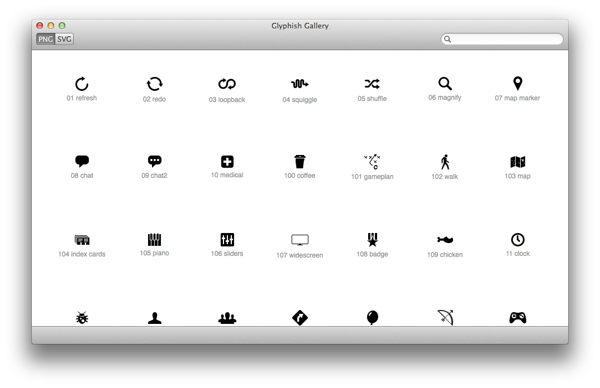
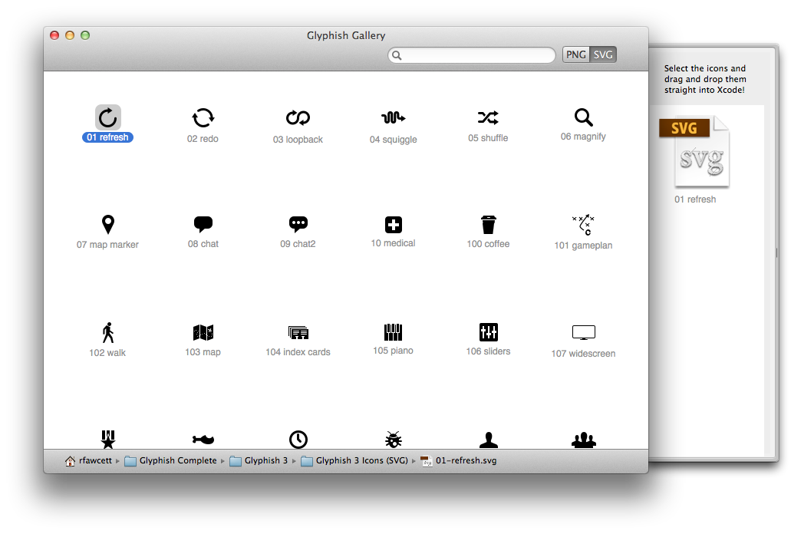
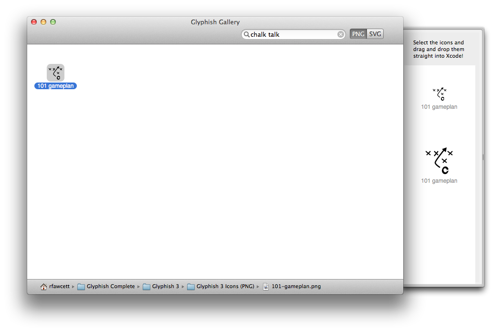
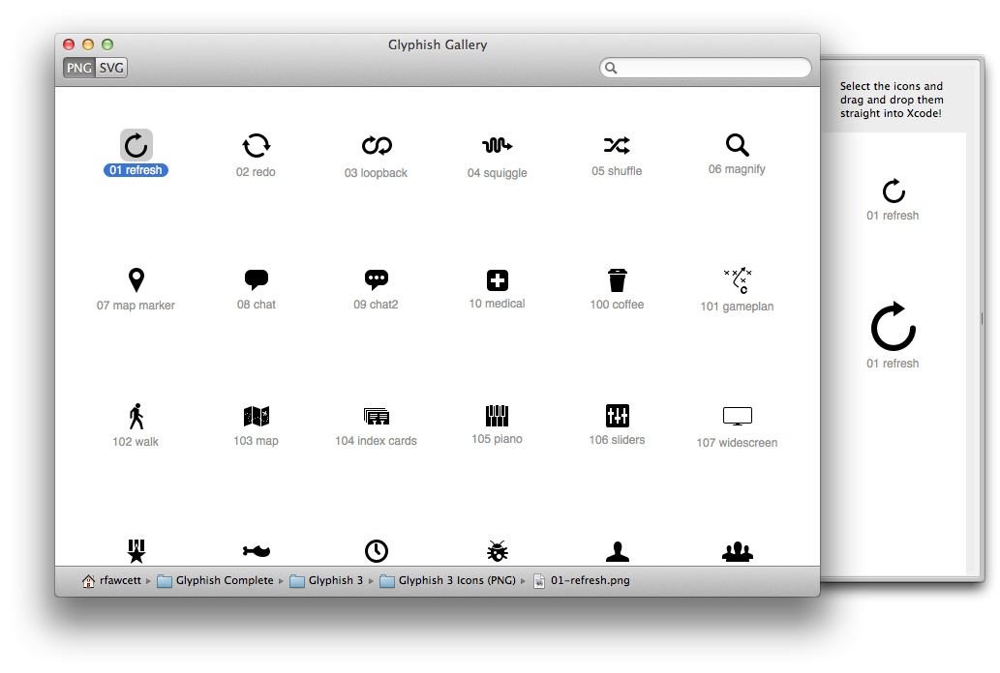
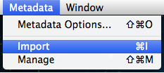
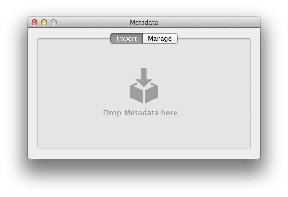
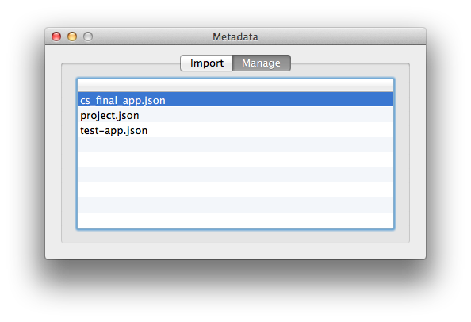

Glyphish Gallery
================

Browse and search through your [Glyphish icons](http://glyphish.com/) in style.



## Features

* Filter between PNG or SVG images*.

* Search through every icon, by name or tags.

* Drag and drop icons right into Xcode.

* Import your own metadata in a JSON file.


<i>*SVG icons included in the .zip with the 5/13/2014 update.</i>

## Changing the Glyphish Folder
To change the location of your Glyphish folder (if it has been moved), or to update it, navigate to "Glyphish Gallery" and then "Preferences...".


Or, you can use the shortcut `⌘.`.

You will then get this preferences window:


On clicking "Pick", a popup file browser will then let you select the folder which you would like to use.  The gallery will then reload with the contents of the new folder.

## Creating Metadata
To edit or add to the master metadata, head on over to the [metadata](https://github.com/glyphish/metadata) repository.

To create your own personal metadata, follow these simple steps:

1. Create a new JSON file, such as `custom.json`.
2. Open the JSON file in your favorite editor.
3. Create an associative array, and use the icon name(s) as the key(s) (without the extension).

```json
{
  "01-refresh":[
  ],
  "02-redo":[
  ],
  // etc.
}
```

<p>4. Add the tags (in quotes) in the value (array) part of the JSON.</p>

```json
{
  "01-refresh":[
    "again",
    "reload",
    "circular arrow",
    // etc.
  ],
  "02-redo":[
    "try again",
    "refresh",
    "circular arrow",
    // etc.
  ],
  // etc.
}
```
<p>5. Go to <a href='http://pro.jsonlint.com/'>JSONLint</a> and make sure that your metadata is valid JSON (or else Glyphish Gallery will NOT be able to process it!).
<p>6. If it passes inspection, save the file and <a href='#importing-metadata'>import the metadata</a>.</p>

## Importing Metadata

To import your own metadata .JSON file, you must first make sure that you have the correct [metadata format](#creating metadata).

After you have inserted all of your metadata, and saved the .JSON file in an easily accessible location, navigate to "Metadata" and then "Import".



Or use the shortcut `⌘I`.

You'll then see this window:



From here, drag and drop your .JSON file onto the dropzone.  The file will then be added!

## Deleting Imported Metadata
To import your imported metadata, navigate to "Metadata" and then "Manage"


Or use the shortcut `⇧⌘M`.

You'll then see this window:



Select a JSON file, and press your delete key to remove it.

Because these files are stored locally, you will need to import them onto different computers, if you use Glyphish on different machines.  In the future, it is possible that they're will be an option to choose a folder for your Glyphish metadata files, and you could create a folder in Dropbox, and keep them synced.

## Support
To resolve any issues you may be having, [open an issue](https://github.com/glyphish/gallery/issues).  Any issues opened will be at least responded to within **24 hours**, and resolved as soon as possible!

## Changelog
#### Version 1.0
- Original project.
- Browse Glyphish icons, and search by icon name.

#### Version 2.0
- Filter between SVG and PNG images.
- Search by icon name or tags.
- Import and Manage custom metadata to enhance searches.

## Contributors

#### Version 1.0
Developed by [Jörgen Isaksson](https://github.com/jorgenisaksson).  Check out Jörgen's work at Bitfield in the [Mac App Store](http://appstore.com/mac/bitfieldab).

#### Version 2.0
Developed by [Rudd Fawcett](http://ruddfawcett.com).  You can find all of his open source projects on [GitHub](https://github.com/ruddfawcett).

#### Glyphish Creator
Designed by [Joseph Wain](https://twitter.com/jpwain).  Visit Joseph's [personal site](http://www.penandthink.com), or peruse his [dribbble](https://dribbble.com/jpwain).

## Connect
- Follow [@Glyphish on Twitter](https://twitter.com/glyphish).
- Signup for [Glyphish news](https://confirmsubscription.com/h/r/7C4D8263FEF6DC79).
- Directly [contact Glyphish](https://helloglyphish.wufoo.com/forms/send-a-message-about-glyphish-icons/).
- Browse [available icon sets](http://www.glyphish.com).
